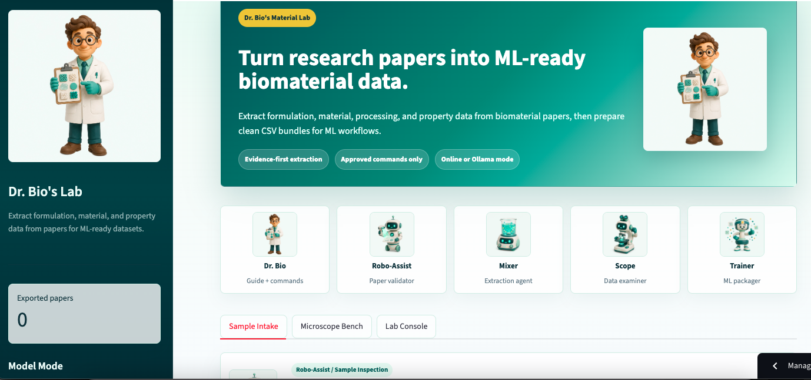
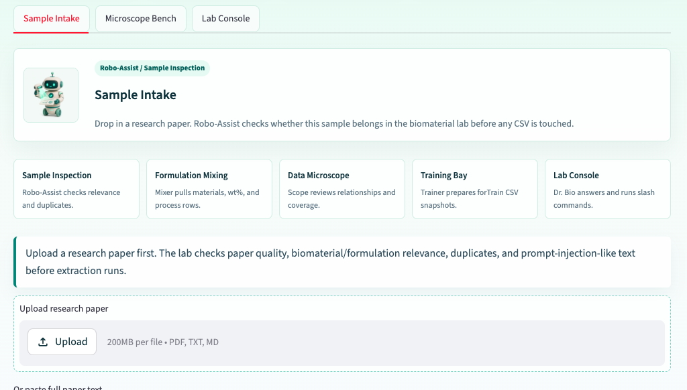
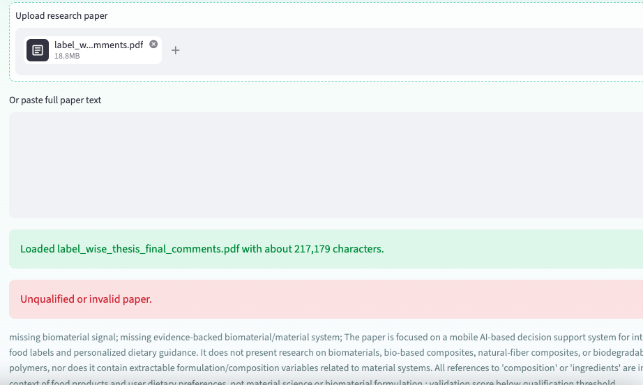
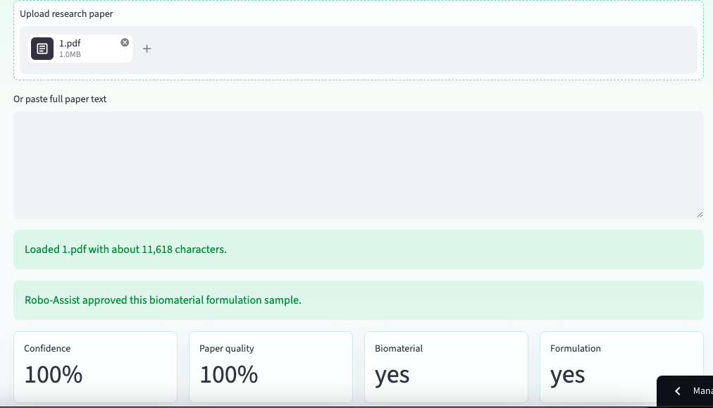
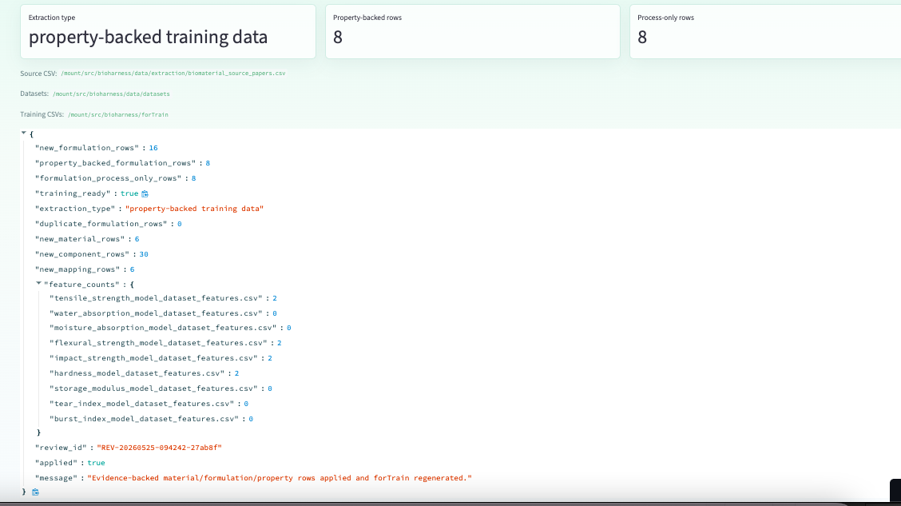
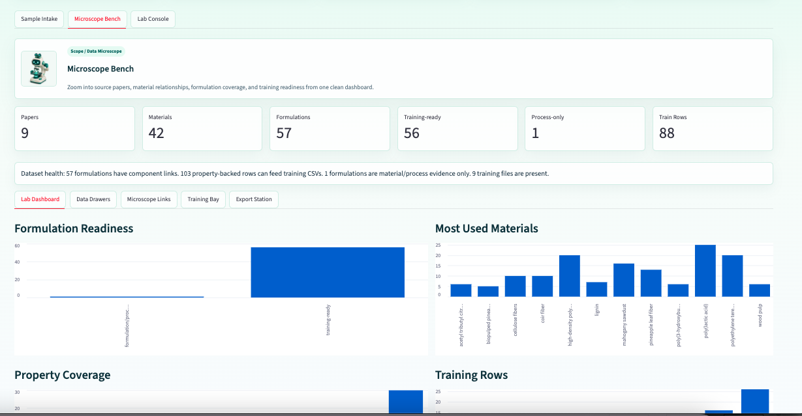
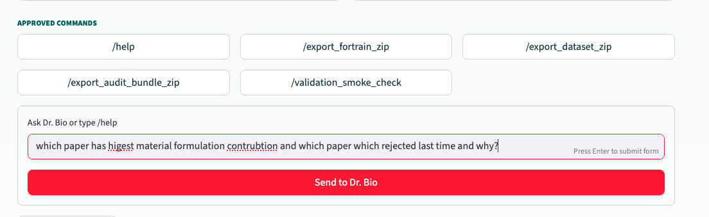
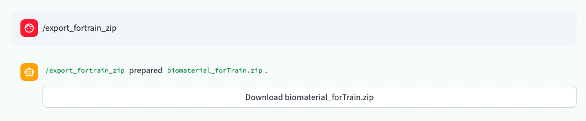

# Dr. Bio's Material Lab Presentation

Interactive Reveal.js presentation for the BioMaterial Agent Harness project.

## View the Presentation

View the presentation here:

https://tokol.github.io/haness_present/

## Presentation Controls

- Press `F` to enter full screen.
- Press `Esc` to exit full screen.
- Press the right arrow key (`->`) to move to the next slide.
- Press the left arrow key (`<-`) to move to the previous slide.
- Click any screenshot/image in the slides to view it enlarged inside the presentation.
- Press `Esc` or click outside the enlarged image to close it.

## App Screenshots

These screenshots show the BioMaterial Harness workflow used in the presentation.

